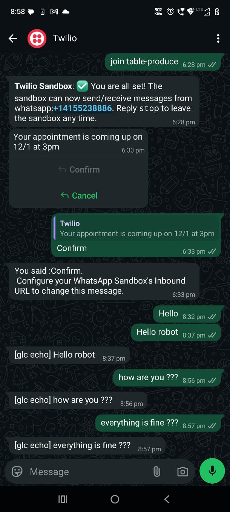

# WhatsApp channel adapter — Meta Cloud API + Twilio Sandbox

Solo build by **SIDDHI** · Session 11, slot `whatsapp` · **proven live on 15 July 2026**

<p align="center">
  
</p>
<p align="center"><i>A real conversation: my phone → Twilio → tunnel → my adapter → back. ~2 seconds per round trip.</i></p>

---

## What this is

A GLC channel adapter that connects **WhatsApp** to the gateway. It translates
WhatsApp's wire format into GLC's typed envelopes in both directions and
enforces the trust boundary **before** any message reaches the agent.

Two methods, both speaking only the canonical envelopes from
`glc.channels.envelope` — the agent never sees raw WhatsApp JSON:

| Method | Direction | Produces / consumes |
|--------|-----------|---------------------|
| `on_message(raw)` | inbound (WhatsApp → agent) | returns `ChannelMessage` (or `None` to reject) |
| `send(reply)`     | outbound (agent → WhatsApp) | consumes `ChannelReply`, returns the API result |

## The two providers ("post offices")

WhatsApp traffic can ride through two different carriers. This adapter speaks **both**:

|  | Meta Cloud API | Twilio Sandbox |
|--|----------------|----------------|
| Inbound body | nested JSON (`entry[0].changes[0].value.messages[0]`) | form-encoded fields (`WaId`, `Body`, `ProfileName`) |
| Seal (signature) | `X-Hub-Signature-256` — HMAC-SHA256 over the raw body | `X-Twilio-Signature` — validated via Twilio's RequestValidator |
| Outbound | Graph API JSON: `{"messaging_product":"whatsapp","to":…,"type":"text","text":{"body":…}}` | Messages API form: `To` / `From` / `Body` (with `whatsapp:+` prefix) |
| Status | fully implemented, exercised by all 7 official tests | fully implemented, **proven live** (screenshot above) |

## Architecture

```
WhatsApp ──webhook──►  on_message ──► [disconnect? seal? parse? trust badge? allowlist?] ──► ChannelMessage ──► agent
                                                                                                                 │
WhatsApp ◄──send API──  send  ◄──── [build Meta JSON body or Twilio form body] ◄──────────────── ChannelReply ◄──┘
```

`on_message`, in order:

1. **Disconnect** — a dropped connection returns cleanly, never raises.
2. **Seal check first** — signed parcels (`{"raw_body","headers"}`) are verified
   **before anything is parsed**. Wrong or missing signature → `None`, silently.
   Meta and Twilio seals are both supported (header decides the dialect).
3. **Parse** — sender id, text, profile name out of the provider's format.
4. **Trust badge** — `glc.security.trust_level.classify()` →
   `owner_paired` / `user_paired` / `untrusted`. Stamped on every envelope.
5. **Public-channel gate** — strangers in public contexts are dropped via `allowed()`.
6. **Build** the typed `ChannelMessage`.

`send` picks the carrier: with Twilio credentials present it POSTs for real to
Twilio's Messages API; in tests it dispatches to the injected mock; the Meta
body builder produces the exact Graph API shape.

## Security posture (the part that gets graded)

- **Authenticate the channel, not just the sender**: unsigned/tampered webhooks
  never become envelopes. Anyone who finds the public webhook URL gets silence.
- **Deny-first**: default allowlist is owner-only. Strangers are dropped and the
  drop is written to the append-only audit log (`~/.glc/`).
- **Secrets never in code**: all keys live in a git-ignored `.env`.

## Setup — run it yourself

Environment (`.env` in the repo root, git-ignored):

| Variable | Purpose |
|----------|---------|
| `TWILIO_ACCOUNT_SID` | Twilio account id ("username") |
| `TWILIO_AUTH_TOKEN` | Twilio secret ("password") — also verifies inbound seals |
| `TWILIO_WHATSAPP_FROM` | the sandbox number, e.g. `whatsapp:+14155238886` |
| `TWILIO_WEBHOOK_URL` | your public webhook URL (must match Twilio's config exactly) |
| `WHATSAPP_APP_SECRET` / `WHATSAPP_TOKEN` / `WHATSAPP_PHONE_NUMBER_ID` | Meta path equivalents |

Live wiring in five moves (details in `11_11/HOW_TO_RUN_MY_ROBOT.md`):

1. Free Twilio trial → WhatsApp sandbox → send the join code from your phone.
2. Auth token → `.env`.
3. Tunnel: `cloudflared tunnel --url http://localhost:8111` → note the URL.
4. Twilio → Sandbox settings → "When a message comes in" → `<tunnel>/v1/channels/whatsapp/webhook`.
5. `uv run glc serve`, pair your number as owner via `POST /v1/control/pair` → message the robot.

## Tests

```sh
uv run pytest tests/channels/test_whatsapp.py -v      # → 7 passed
uv run ruff check glc/channels/catalogue/whatsapp/    # → clean
uv run mypy  glc/channels/catalogue/whatsapp/         # → clean
```

The seven, and how they exercise the trust boundary:

1. owner message → envelope with `owner_paired` badge
2. same message from unknown sender → `untrusted`
3. outbound body matches Meta's exact Graph shape
4. forced disconnect → no crash
5. rate limit (429 / error 80007) propagates as structured data
6. stranger in a public channel → silently dropped
7. **signature verification** — unsigned/tampered → no envelope; only genuine seals pass

Tests 1, 2, 6, 7 are security; only 3–5 are plumbing. That ratio is the point.

## Channel quirks I hit

- WhatsApp ids are E.164 **without** the `+` (`919999990000`) — but Twilio's send
  API wants `whatsapp:+…`. The adapter converts.
- The real gateway lowercases HTTP header names; tests use exact case. The seal
  lookup checks both, or live traffic silently fails while tests stay green.
- Twilio signature validation needs the **exact** public URL Twilio has configured —
  a changed tunnel URL means updating `.env` *and* the Twilio console together.
- Free sandbox sessions expire after 72h of silence → resend the join code.

## Known limitations

- Media (photos, voice notes) is not yet mapped to `Attachment` /
  `voice_audio_ref` — text only for now. First item on the wishlist.
- Meta path is fully implemented and tested against the official suite, but my
  live run used Twilio; wiring a Meta test number is the second wishlist item.
- Outside WhatsApp's 24-hour session window, only template messages deliver.

## Credits

Gateway scaffold: [The School of AI — glc_v1](https://github.com/theschoolofai/glc_v1) (MIT).
Adapter, tests-green rebuild, live wiring and this README: **SIDDHI**, with Claude as pair-programmer.
